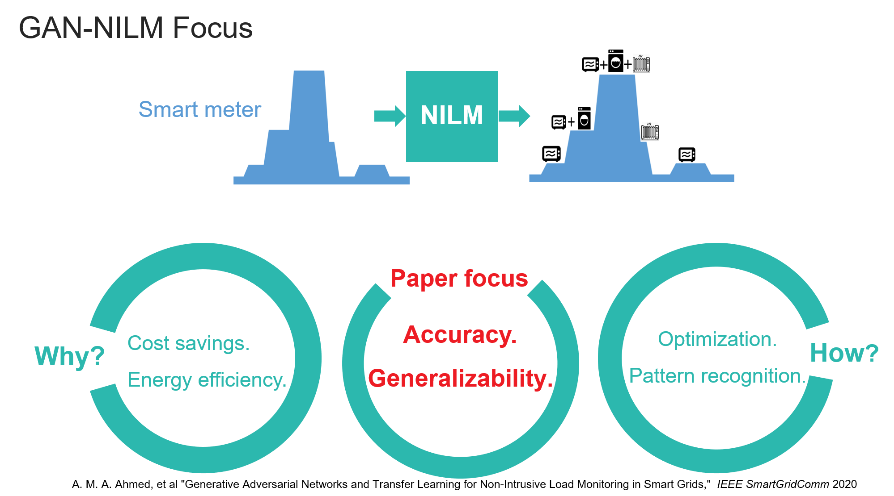
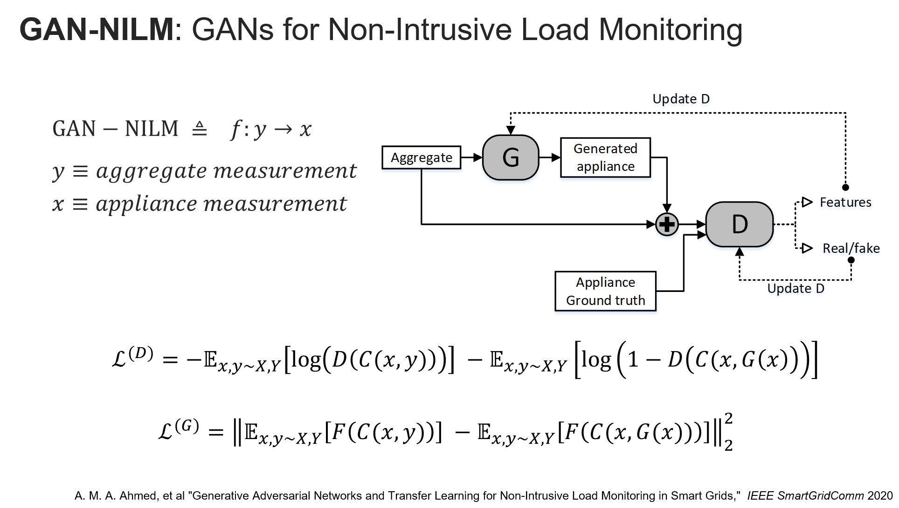
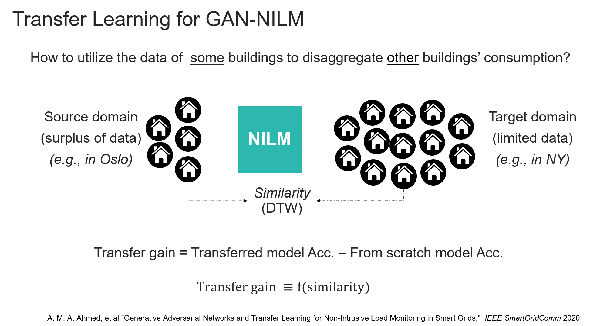
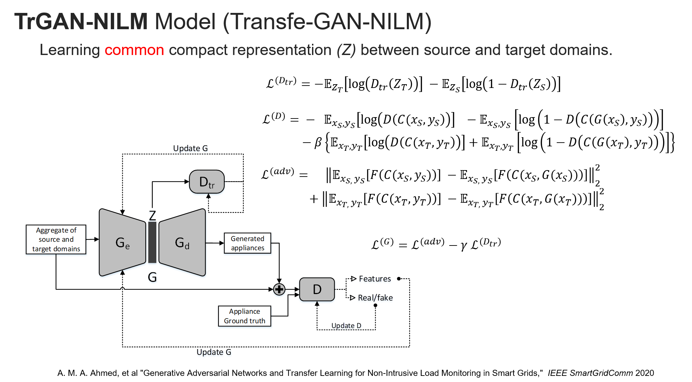
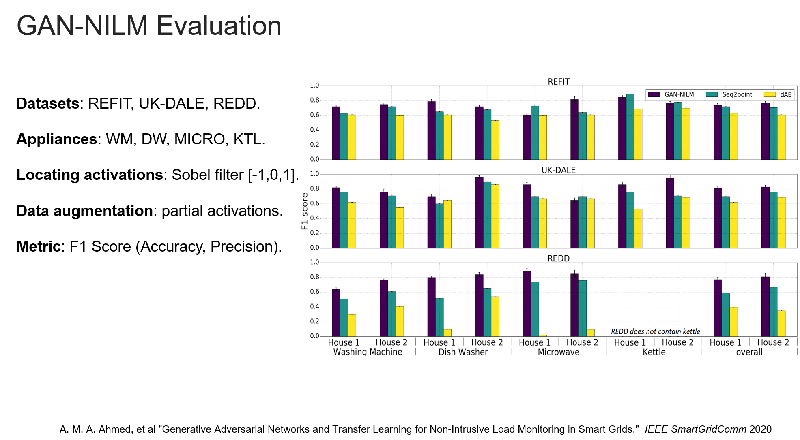

# What is GAN-NILM
GAN-NILM tries to perform Non-Intrusive Load Monitoring using Generative Adversarial Networks.
That is, in plain language, a model that takes only a building total measurement and tries to tell which appliances are On/Off at every time step.  
The exact model is described in this presentation:
https://www.youtube.com/watch?v=Z_K5YEuSCOs&t=4s  
Which is a suymmary of this paper:
https://ieeexplore.ieee.org/document/9302933

# Model 1

# Transfer Learning

# Model 2 

# Evaluation

# Dataset  
Datasets used can be found:  
1. REFIT: https://www.refitsmarthomes.org/datasets/  
2. UKDALE: https://jack-kelly.com/data/  
3. REDD: http://redd.csail.mit.edu/  

# Content  
The repository consists of ipynb files of the experiment already run. It still shows the outputs that were not deleted to give insigts about the results.  

# Citation  
Please cite:  
A. M. A. Ahmed, Y. Zhang and F. Eliassen, "Generative Adversarial Networks and Transfer Learning for Non-Intrusive Load Monitoring in Smart Grids," 2020 IEEE International Conference on Communications, Control, and Computing Technologies for Smart Grids (SmartGridComm), Tempe, AZ, USA, 2020, pp. 1-7, doi: 10.1109/SmartGridComm47815.2020.9302933.

BibTeX:  
@INPROCEEDINGS{9302933,  
  author={A. M. A. {Ahmed} and Y. {Zhang} and F. {Eliassen}},    
  booktitle={2020 IEEE International Conference on Communications, Control, and Computing Technologies for Smart Grids (SmartGridComm)},    
  title={Generative Adversarial Networks and Transfer Learning for Non-Intrusive Load Monitoring in Smart Grids},    
  year={2020},    
  volume={},  
  number={},    
  pages={1-7},    
  doi={10.1109/SmartGridComm47815.2020.9302933}}
  
